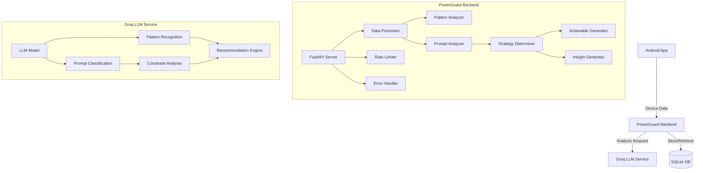
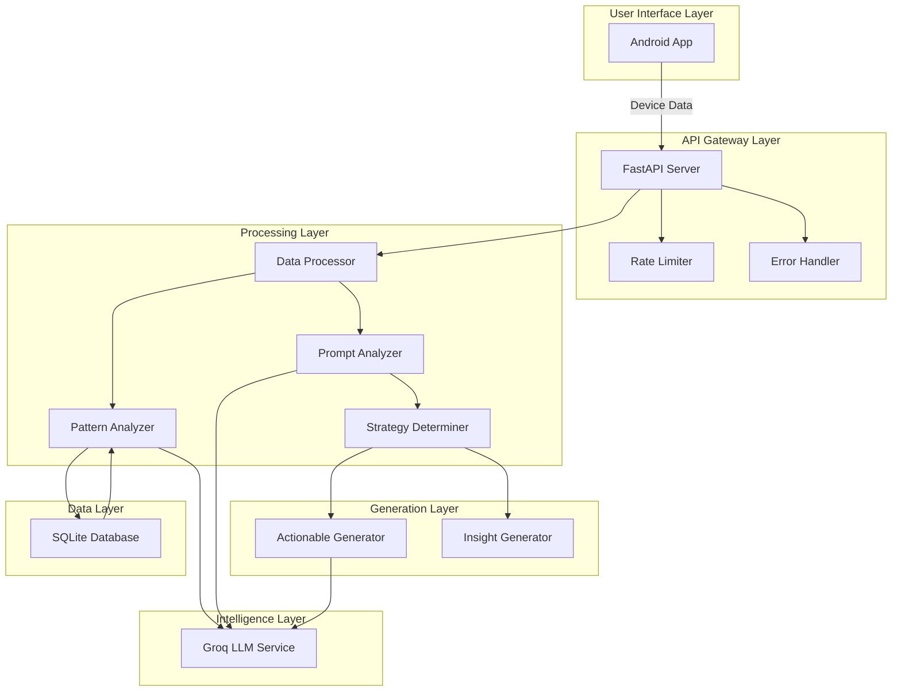
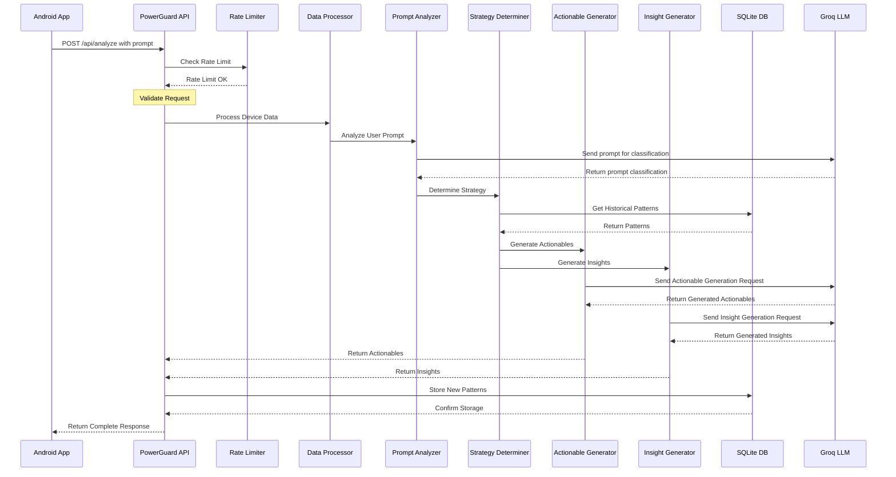
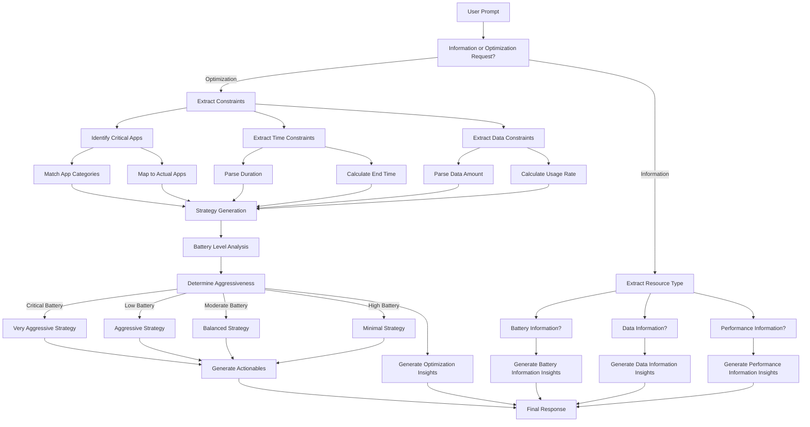
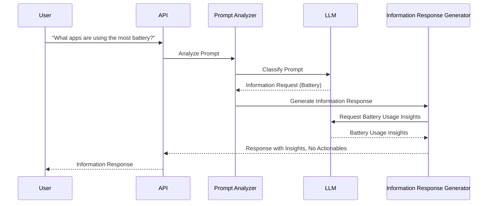
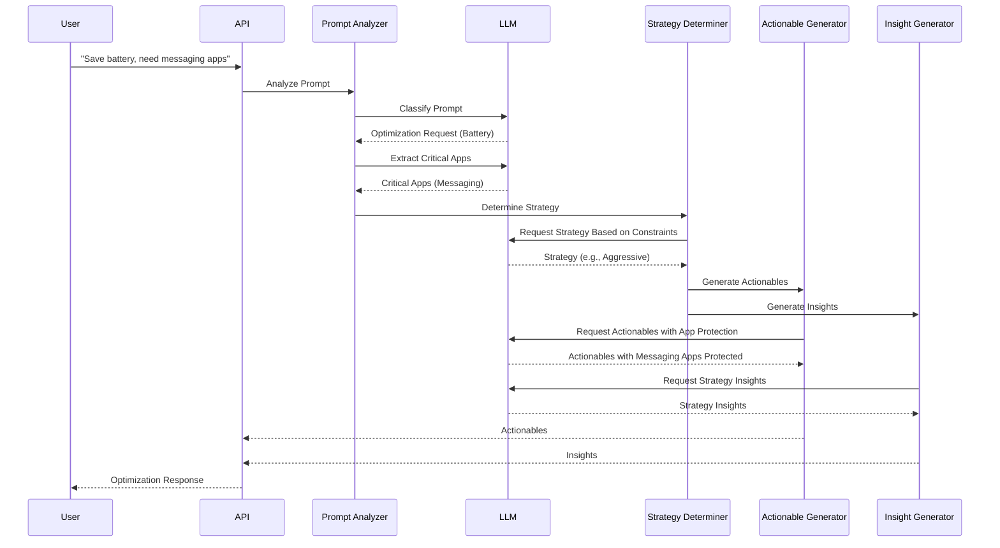
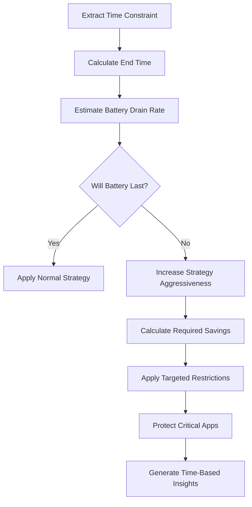
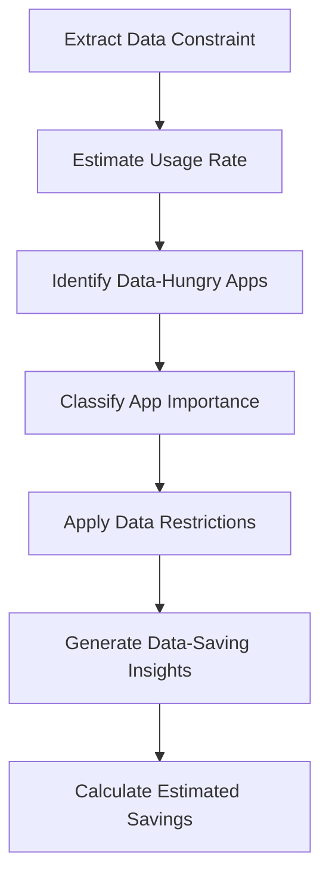

# PowerGuard AI Backend Architecture

## High-Level Design (HLD)

### System Architecture



### Layered Architecture



### Components

1. **Client Application**
   - Android app collecting device data
   - Sends usage statistics to backend
   - Receives and displays recommendations

2. **Backend Service**
   - FastAPI-based REST API
   - SQLite database for data persistence
   - Integration with Groq LLM
   - Usage pattern analysis
   - Rate limiting and DDoS protection
   - Error handling and logging
   - Prompt analysis and classification
   - Strategy determination
   - Actionable generation
   - Insight generation

3. **AI Service**
   - Groq LLM for intelligent analysis
   - Pattern recognition
   - Recommendation generation
   - Retry mechanism for API calls
   - Constraint extraction and analysis
   - Prompt classification

### Data Flow



### Smart Prompt Analysis Flow



## API Documentation

### Endpoints

#### POST /api/analyze
Analyzes device data and returns optimization recommendations.

**Request Body:**
```json
{
    "deviceId": "string",
    "timestamp": "integer",
    "battery": {
        "level": "float",
        "health": "float",
        "temperature": "float"
    },
    "memory": {
        "total": "integer",
        "used": "integer",
        "free": "integer"
    },
    "cpu": {
        "usage": "float",
        "temperature": "float"
    },
    "network": {
        "dataUsed": "float",
        "wifiEnabled": "boolean",
        "mobileDataEnabled": "boolean"
    },
    "apps": [
        {
            "packageName": "string",
            "batteryUsage": "float",
            "dataUsage": "float",
            "foregroundTime": "integer"
        }
    ],
    "prompt": "string"  // Optional
}
```

**Response:**
```json
{
    "id": "string",
    "success": "boolean",
    "timestamp": "float",
    "message": "string",
    "actionable": [
        {
            "id": "string",
            "type": "string",
            "packageName": "string",
            "description": "string",
            "reason": "string",
            "newMode": "string",
            "parameters": {}
        }
    ],
    "insights": [
        {
            "type": "string",
            "title": "string",
            "description": "string",
            "severity": "string"
        }
    ],
    "batteryScore": "float",
    "dataScore": "float",
    "performanceScore": "float",
    "estimatedSavings": {
        "batteryMinutes": "float",
        "dataMB": "float"
    }
}
```

#### GET /api/patterns/{device_id}
Retrieves stored usage patterns for a specific device.

**Response:**
```json
{
    "packageName1": "pattern1",
    "packageName2": "pattern2"
}
```

#### POST /api/reset-db
Resets the database (use with caution).

**Response:**
```json
{
    "status": "success",
    "message": "Database reset successfully completed"
}
```

#### GET /api/all-entries
Retrieves all database entries.

**Response:**
```json
[
    {
        "id": "integer",
        "device_id": "string",
        "package_name": "string",
        "pattern": "string",
        "timestamp": "string",
        "raw_timestamp": "integer"
    }
]
```

### Rate Limits

- Default endpoints: 1000 requests per minute
- Analyze endpoint: 500 requests per minute
- Patterns endpoint: 1000 requests per minute
- Reset DB endpoint: 100 requests per hour

### Error Handling

The API uses standard HTTP status codes:
- 200: Success
- 400: Bad Request
- 429: Too Many Requests
- 500: Internal Server Error

Error responses include:
```json
{
    "error": "string",
    "message": "string",
    "timestamp": "integer",
    "path": "string"
}
```

## Low-Level Design (LLD)

### Database Schema

```sql
CREATE TABLE usage_patterns (
    id INTEGER PRIMARY KEY,
    deviceId TEXT NOT NULL,
    packageName TEXT NOT NULL,
    pattern TEXT NOT NULL,
    timestamp INTEGER NOT NULL,
    UNIQUE(deviceId, packageName)
);
```

### Key Components

1. **Data Collection**
   - App usage tracking
   - Battery monitoring
   - Network usage tracking
   - Wake lock detection

2. **Analysis Engine**
   - Pattern recognition
   - Historical data analysis
   - Recommendation generation
   - Prompt analysis and classification
   - User-directed optimization focus
   - Critical app protection
   - Battery level based strategies
   - Time and data constraint handling
   - Information vs optimization request detection

3. **Storage Layer**
   - SQLite database
   - Pattern persistence
   - Historical data storage

4. **Security Layer**
   - Rate limiting
   - Input validation
   - Error handling
   - Logging

### Smart Prompt Analysis

The system implements an intelligent prompt analysis pipeline that understands user intentions:

#### Information Request Handling

When a user asks for information (e.g., "What apps are using the most battery?"), the system:

1. Identifies the request as an information request
2. Determines the resource type of interest (battery, data, or both)
3. Retrieves the relevant resource usage data
4. Generates insights with the requested information
5. Returns a response with insights but no actionable recommendations



#### Optimization Request Handling

When a user asks for optimization (e.g., "Save my battery" or "I need maps for 3 hours"), the system:

1. Identifies the request as an optimization request
2. Identifies any critical app categories mentioned (e.g., messaging, navigation)
3. Extracts time constraints if mentioned (e.g., "for 3 hours")
4. Extracts data constraints if mentioned (e.g., "500MB left")
5. Analyzes battery level to determine base strategy aggressiveness
6. Adjusts strategy based on time and data constraints
7. Generates actionables that protect critical apps and optimize others
8. Generates insights explaining the strategy and expected savings
9. Returns a comprehensive response with actionables and insights



### Critical App Categories

The system recognizes specific app categories that users often need to keep working:

1. **Messaging Apps**
   - WhatsApp, Messenger, Telegram, Signal, WeChat
   - Keywords: "messaging", "chat", "communication", "WhatsApp", "Messenger"

2. **Navigation Apps**
   - Google Maps, Waze, Mapbox, Apple Maps, HERE Maps
   - Keywords: "maps", "navigation", "directions", "GPS", "Google Maps"

3. **Email Apps**
   - Gmail, Outlook, ProtonMail, Apple Mail
   - Keywords: "email", "mail", "Gmail", "Outlook"

4. **Work/Productivity Apps**
   - Slack, Microsoft Teams, Zoom, Office apps
   - Keywords: "work", "office", "productivity", "Slack", "Teams", "Zoom"

5. **Health & Safety Apps**
   - Health monitoring, Emergency services
   - Keywords: "health", "emergency", "medical", "safety"

When users mention these categories (e.g., "need messages" or "using maps"), the system ensures these apps remain fully functional while optimizing other resources.

### Battery Level Based Strategies

The system adapts its optimization strategy based on current battery level:

| Battery Level | Strategy | Approach | App Treatment | UI Adjustments |
|--------------|----------|----------|--------------|----------------|
| ≤10% | Very Aggressive | Maximum restrictions on non-critical apps | Kill background for all non-critical, restrict even moderately used apps | Reduce brightness significantly, force dark mode, disable animations |
| ≤30% | Aggressive | Strong restrictions on background activity | Restrict background for most apps, optimize moderately used apps | Reduce brightness moderately, suggest dark mode, reduce animations |
| ≤50% | Moderate | Balanced approach focusing on problematic apps | Restrict only high-consuming apps, optimize moderate consumers | Suggest brightness reduction, normal animations |
| >50% | Minimal | Light optimizations only for the most resource-intensive apps | Restrict only extremely high consumers | No UI adjustments |

This adaptive approach ensures that battery-saving measures are proportional to the urgency of the situation.

### Time Constraint Processing

When users specify a time constraint (e.g., "need battery to last 3 hours"), the system:

1. Extracts the duration (3 hours)
2. Calculates target end time (current time + 3 hours)
3. Estimates current battery drain rate based on usage patterns
4. Determines if normal drain rate will satisfy the time constraint
5. If not, adjusts strategy aggressiveness to meet the time requirement
6. Prioritizes critical apps mentioned in the prompt
7. Applies more aggressive restrictions to non-critical apps when necessary



### Data Constraint Processing

When users specify a data constraint (e.g., "only have 500MB left"), the system:

1. Extracts the data limit (500MB)
2. Estimates current data usage rate based on app patterns
3. Identifies high data-consuming apps
4. Applies appropriate restrictions based on app importance
5. Generates data-saving recommendations
6. Provides estimated data savings



### Implementation Details

1. **FastAPI Application**
   - Uses dependency injection for database sessions
   - Implements middleware for rate limiting
   - Provides comprehensive error handling
   - Includes detailed logging

2. **LLM Integration**
   - Uses Groq API with retry mechanism
   - Implements exponential backoff
   - Handles API failures gracefully
   - Provides fallback responses

3. **Database Operations**
   - Uses SQLAlchemy ORM
   - Implements connection pooling
   - Provides session management
   - Includes error handling

4. **Rate Limiting**
   - Implements token bucket algorithm
   - Provides configurable limits per endpoint
   - Includes detailed logging
   - Handles edge cases gracefully

5. **Prompt Analysis Pipeline**
   - Rule-based pre-classification
   - LLM-based deep analysis
   - Constraint extraction
   - Category recognition
   - Intent determination

6. **Strategy Determination**
   - Battery level thresholds
   - Constraint-based adjustments
   - Critical app protection
   - Resource usage analysis
   - Time-based planning

7. **Response Generation**
   - Actionable generation based on strategy
   - Insight generation based on request type
   - Resource score calculation
   - Savings estimation
   - Response assembly 