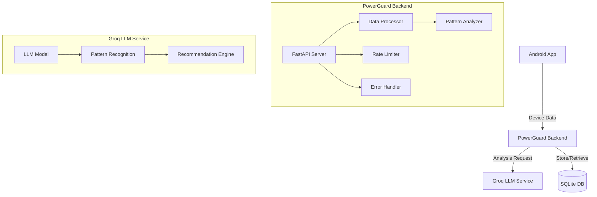
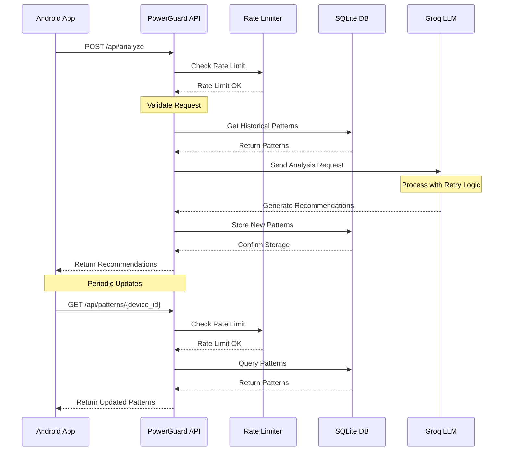

# PowerGuard AI Backend Architecture

## High-Level Design (HLD)

### System Architecture



### Components

1. **Client Application**
   - Android app collecting device data
   - Sends usage statistics to backend
   - Receives and displays recommendations

2. **Backend Service**
   - FastAPI-based REST API
   - SQLite database for data persistence
   - Integration with Groq LLM
   - Usage pattern analysis
   - Rate limiting and DDoS protection
   - Error handling and logging

3. **AI Service**
   - Groq LLM for intelligent analysis
   - Pattern recognition
   - Recommendation generation
   - Retry mechanism for API calls

### Data Flow



## API Documentation

### Endpoints

#### POST /api/analyze
Analyzes device data and returns optimization recommendations.

**Request Body:**
```json
{
    "deviceId": "string",
    "timestamp": "integer",
    "battery": {
        "level": "float",
        "health": "float",
        "temperature": "float"
    },
    "memory": {
        "total": "integer",
        "used": "integer",
        "free": "integer"
    },
    "cpu": {
        "usage": "float",
        "temperature": "float"
    },
    "network": {
        "dataUsed": "float",
        "wifiEnabled": "boolean",
        "mobileDataEnabled": "boolean"
    },
    "apps": [
        {
            "packageName": "string",
            "batteryUsage": "float",
            "dataUsage": "float",
            "foregroundTime": "integer"
        }
    ],
    "prompt": "string"  // Optional
}
```

**Response:**
```json
{
    "id": "string",
    "success": "boolean",
    "timestamp": "float",
    "message": "string",
    "actionable": [
        {
            "id": "string",
            "type": "string",
            "packageName": "string",
            "description": "string",
            "reason": "string",
            "newMode": "string",
            "parameters": {}
        }
    ],
    "insights": [
        {
            "type": "string",
            "title": "string",
            "description": "string",
            "severity": "string"
        }
    ],
    "batteryScore": "float",
    "dataScore": "float",
    "performanceScore": "float",
    "estimatedSavings": {
        "batteryMinutes": "float",
        "dataMB": "float"
    }
}
```

#### GET /api/patterns/{device_id}
Retrieves stored usage patterns for a specific device.

**Response:**
```json
{
    "packageName1": "pattern1",
    "packageName2": "pattern2"
}
```

#### POST /api/reset-db
Resets the database (use with caution).

**Response:**
```json
{
    "status": "success",
    "message": "Database reset successfully completed"
}
```

#### GET /api/all-entries
Retrieves all database entries.

**Response:**
```json
[
    {
        "id": "integer",
        "device_id": "string",
        "package_name": "string",
        "pattern": "string",
        "timestamp": "string",
        "raw_timestamp": "integer"
    }
]
```

### Rate Limits

- Default endpoints: 1000 requests per minute
- Analyze endpoint: 500 requests per minute
- Patterns endpoint: 1000 requests per minute
- Reset DB endpoint: 100 requests per hour

### Error Handling

The API uses standard HTTP status codes:
- 200: Success
- 400: Bad Request
- 429: Too Many Requests
- 500: Internal Server Error

Error responses include:
```json
{
    "error": "string",
    "message": "string",
    "timestamp": "integer",
    "path": "string"
}
```

## Low-Level Design (LLD)

### Database Schema

```sql
CREATE TABLE usage_patterns (
    id INTEGER PRIMARY KEY,
    deviceId TEXT NOT NULL,
    packageName TEXT NOT NULL,
    pattern TEXT NOT NULL,
    timestamp INTEGER NOT NULL,
    UNIQUE(deviceId, packageName)
);
```

### Key Components

1. **Data Collection**
   - App usage tracking
   - Battery monitoring
   - Network usage tracking
   - Wake lock detection

2. **Analysis Engine**
   - Pattern recognition
   - Historical data analysis
   - Recommendation generation
   - Prompt analysis and classification
   - User-directed optimization focus

3. **Storage Layer**
   - SQLite database
   - Pattern persistence
   - Historical data storage

4. **Security Layer**
   - Rate limiting
   - Input validation
   - Error handling
   - Logging

### Implementation Details

1. **FastAPI Application**
   - Uses dependency injection for database sessions
   - Implements middleware for rate limiting
   - Provides comprehensive error handling
   - Includes detailed logging

2. **LLM Integration**
   - Uses Groq API with retry mechanism
   - Implements exponential backoff
   - Handles API failures gracefully
   - Provides fallback responses

3. **Database Operations**
   - Uses SQLAlchemy ORM
   - Implements connection pooling
   - Provides session management
   - Includes error handling

4. **Rate Limiting**
   - Implements token bucket algorithm
   - Provides configurable limits per endpoint
   - Includes detailed logging
   - Handles edge cases gracefully 