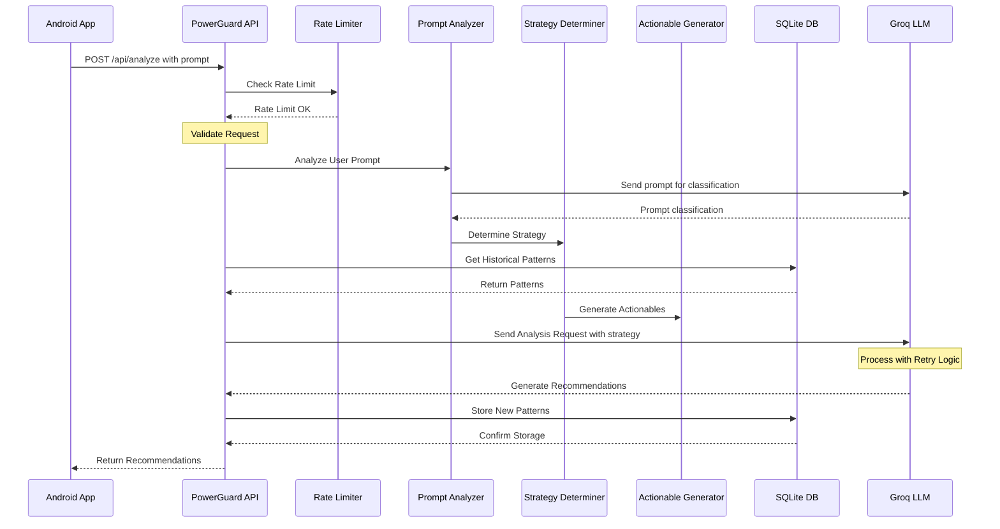

# PowerGuard AI Backend

<div align="center">
  
  
  
  
</div>

<p align="center">An advanced AI-powered backend service that intelligently analyzes Android device usage patterns and provides contextual optimization recommendations for battery life and data usage through natural language processing.</p>


## ✨ Key Features

### 🧠 Advanced AI Query Processing
- **6 Query Categories**: Information, Predictive, Optimization, Monitoring, Routing, Pattern Analysis
- **3 Resource Types**: Battery, Data, and Performance optimization
- **Natural Language Understanding**: Processes complex user prompts with contextual awareness
- **Smart Intent Detection**: Distinguishes between information requests and action requests

### 🎯 Intelligent Optimization Engine
- **Battery Level-Based Strategies**: Adapts aggressiveness from Minimal (>50%) to Very Aggressive (≤10%)
- **Critical App Protection**: Automatically protects messaging, navigation, email, and work apps
- **Constraint Processing**: Handles time limits ("need 3 hours") and data limits ("500MB left")
- **5 Actionable Types**: Standby bucket management, background data restriction, app termination, wake lock management, CPU throttling

### 🔄 Hybrid Analysis Architecture
- **Rule-Based Pre-processing**: Fast initial categorization and constraint extraction
- **LLM-Powered Deep Analysis**: Groq integration for nuanced understanding and recommendations
- **Usage Pattern Learning**: SQLite-based historical analysis and pattern recognition
- **Retry Mechanisms**: Exponential backoff for API reliability

## 🏗️ System Architecture

PowerGuard follows a modular, layered architecture designed for scalability and maintainability:

```
┌─────────────────┐    ┌──────────────────┐    ┌─────────────────┐
│   Android App   │───▶│  FastAPI Server  │───▶│   Groq LLM      │
│   (Client)      │    │                  │    │   Service       │
└─────────────────┘    └──────────────────┘    └─────────────────┘
                              │
                              ▼
                       ┌──────────────────┐
                       │   SQLite DB      │
                       │  (Usage Patterns)│
                       └──────────────────┘
```

### Core Components

- **FastAPI Server** (`app/main.py`): REST API with rate limiting and validation
- **Query Processor** (`app/prompts/query_processor.py`): Advanced prompt analysis with 6 categories
- **Strategy Analyzer** (`app/utils/strategy_analyzer.py`): Battery-level based strategy determination
- **Actionable Generator** (`app/utils/actionable_generator.py`): Creates specific device actions
- **Insight Generator** (`app/utils/insight_generator.py`): Generates user-friendly explanations
- **LLM Service** (`app/llm_service.py`): Groq API integration with retry logic
- **Database Layer** (`app/database.py`): SQLAlchemy ORM with usage pattern storage

## 🚀 API Endpoints

| Method | Endpoint | Description | Security Level |
|--------|----------|-------------|----------------|
| `POST` | `/api/analyze` | **Main Analysis Endpoint** - Process device data with optional user prompt | Rate Limited |
| `GET` | `/api/patterns/{device_id}` | Retrieve historical usage patterns for specific device | Public |
| `POST` | `/api/reset-db` | ⚠️ **DANGEROUS** - Completely reset database | Restricted |
| `GET` | `/api/all-entries` | Get all database entries for debugging | Development Only |

### Analysis Request Format
```json
{
  "deviceId": "unique-device-identifier",
  "timestamp": 1686123456,
  "prompt": "Save my battery for next 3 hours", // Optional
  "battery": {
    "level": 25,
    "temperature": 35,
    "isCharging": false,
    "voltage": 3800,
    "health": 1,
    "capacity": 4000
  },
  "memory": {
    "totalRam": 8192,
    "availableRam": 4096,
    "lowMemory": false
  },
  "cpu": {
    "usage": 15,
    "temperature": 45
  },
  "network": {
    "type": "wifi",
    "strength": 85,
    "dataUsage": {"foreground": 100, "background": 50}
  },
  "apps": [
    {
      "packageName": "com.whatsapp",
      "appName": "WhatsApp",
      "batteryUsage": 5.2,
      "dataUsage": {"foreground": 20, "background": 5},
      "foregroundTime": 300,
      "backgroundTime": 150
    }
  ]
}
```

## 🧠 AI Query Processing System

PowerGuard's advanced query processing system categorizes and handles different types of user requests:

### 6 Query Categories

| Category | Description | Example Prompts | Response Type |
|----------|-------------|-----------------|---------------|
| **INFORMATION** | Requesting current usage data | "What apps use most battery?", "Show data usage" | Insights only, no actions |
| **PREDICTIVE** | Future planning questions | "Will battery last 3 hours?", "Can I stream video?" | Predictions with conditional advice |
| **OPTIMIZATION** | Direct optimization requests | "Save battery", "Reduce data usage" | Actionables + insights |
| **MONITORING** | Setting up alerts/tracking | "Alert me when battery is low" | Configuration actions |
| **ROUTING** | App-specific management | "Manage WhatsApp settings" | Targeted app actions |
| **PATTERN_ANALYSIS** | Usage pattern insights | "Why is battery draining fast?" | Deep analysis insights |

### 3 Resource Types

- **BATTERY**: Power consumption optimization
- **DATA**: Network usage optimization  
- **OTHER**: Performance, storage, general optimization

## 🔋 Battery Level-Based Optimization Strategy

PowerGuard adapts its optimization aggressiveness based on current battery level and user constraints:

| Battery Level | Strategy | Approach | Example Actions |
|--------------|----------|----------|----------------|
| **≤10% (Critical)** | Very Aggressive | Maximum power conservation | Kill non-critical apps, force dark mode, disable sync |
| **≤30% (Low)** | Aggressive | Strong background restrictions | Limit background refresh, reduce location services |
| **≤50% (Moderate)** | Balanced | Focus on problematic apps | Optimize high-drain apps, normal sync intervals |
| **>50% (High)** | Minimal | Light optimizations only | Target extreme battery consumers only |

### 5 Actionable Types

PowerGuard generates specific device actions using these categories:

1. **SET_STANDBY_BUCKET** - App standby state management (Active, Working Set, Frequent, Rare, Restricted)
2. **RESTRICT_BACKGROUND_DATA** - Network access control for background processes
3. **KILL_APP** - Immediate app termination for critical battery saving
4. **MANAGE_WAKE_LOCKS** - Power management lock control
5. **THROTTLE_CPU_USAGE** - CPU frequency and usage limitations

## 🔄 Data Flow



## 🧩 Components

1. **Client Application**
   - Android app collecting device data
   - Sends usage statistics to backend
   - Receives and displays recommendations

2. **Backend Service**
   - FastAPI-based REST API
   - SQLite database for data persistence
   - Integration with Groq LLM
   - Usage pattern analysis
   - Strategy determination
   - Actionable generation

3. **AI Service**
   - Groq LLM for intelligent analysis
   - Pattern recognition
   - Recommendation generation
   - Prompt classification

## 🔋 Battery Level Based Strategies

PowerGuard adapts its optimization strategy based on current battery level:

| Battery Level | Strategy | Approach | Example Actions |
|--------------|----------|----------|----------------|
| ≤10% (Critical) | Very Aggressive | Maximum restrictions on non-critical apps, significant UI optimizations | Kill background processes, force dark mode, limit sync, restrict GPS |
| ≤30% (Low) | Aggressive | Strong restrictions on background activity, moderate UI optimizations | Restrict background refresh, moderate sync intervals, reduce location precision |
| ≤50% (Moderate) | Balanced | Balanced approach focusing on problematic apps | Optimize problematic apps, normal sync intervals, standard UI settings |
| >50% (High) | Minimal | Light optimizations only for the most resource-intensive apps | Target only extremely high battery consumers, normal operation for most apps |

## 🗣️ Using Prompts for Directed Optimization

The PowerGuard system supports user-directed optimizations through the optional `prompt` field in the `/api/analyze` endpoint. This feature allows users to specify their optimization goals in natural language, and the system will adjust its analysis and recommendations accordingly.

### Prompt Types and Examples

#### Information Requests

| Request Type | Example Prompts | System Response |
|--------------|----------------|-----------------|
| Battery Usage Information | "What apps are using the most battery?" | Returns insights about battery-consuming apps without actionable recommendations |
| Data Usage Information | "Which apps are using the most data?" | Returns insights about data-consuming apps without actionable recommendations |
| General Information | "Show me my usage patterns" | Returns general usage insights without specific actionable recommendations |

#### Optimization Requests

| Request Type | Example Prompts | System Response |
|--------------|----------------|-----------------|
| Battery Optimization | "Optimize battery life", "Save power", "Make battery last longer" | Generates battery-focused optimization actions |
| Data Optimization | "Reduce data usage", "Save network data", "Optimize internet usage" | Generates data-focused optimization actions |
| Combined Optimization | "Optimize both battery and data", "Save resources", "Make phone more efficient" | Balanced optimization for both battery and data |
| Specific Actions | "Kill battery-draining apps", "Restrict background data", "Turn off unnecessary services" | Generates very specific actions matching the request |
| Critical App Protection | "Keep WhatsApp working", "I need maps and messages", "Don't touch my email app" | Protects specified apps while optimizing others |
| Time Constraints | "Need battery to last 4 hours", "Make phone last until tonight", "Save battery until I get home" | Adjusts strategy aggressiveness based on time requirement |
| Data Constraints | "I only have 500MB left", "Save data, almost at my limit", "Strict data saving mode" | Focuses heavily on data optimization |
| Complex Constraints | "I'm traveling for 3 hours and need maps and messaging but save battery" | Comprehensive strategy balancing all constraints |

### Critical App Categories

PowerGuard recognizes these critical app categories that are often protected during optimization:

1. **Messaging Apps**: WhatsApp, Messenger, Telegram, Signal, WeChat
2. **Navigation Apps**: Google Maps, Waze, Apple Maps, Mapbox, HERE Maps
3. **Email Apps**: Gmail, Outlook, ProtonMail, Apple Mail
4. **Work/Productivity**: Slack, Teams, Zoom, Office apps, Google Workspace
5. **Health & Safety**: Health monitoring, Emergency services, Safety alerts

## 📝 Sample API Responses

### Example 1: Battery Optimization

**Request:**
```json
{
  "deviceId": "example-device-001",
  "timestamp": 1686123456,
  "battery": { "level": 15 },
  "apps": [
    {"packageName": "com.whatsapp", "batteryUsage": 5.2, "dataUsage": 20.1, "foregroundTime": 10},
    {"packageName": "com.instagram", "batteryUsage": 15.4, "dataUsage": 45.3, "foregroundTime": 25},
    {"packageName": "com.facebook.katana", "batteryUsage": 12.1, "dataUsage": 30.2, "foregroundTime": 15}
  ],
  "prompt": "Save my battery"
}
```

**Response:**
```json
{
  "id": "resp-12345",
  "success": true,
  "timestamp": 1686123458,
  "message": "Battery optimization strategy applied",
  "actionable": [
    {
      "id": "act-001",
      "type": "app_restriction",
      "packageName": "com.facebook.katana",
      "description": "Restrict Facebook background activity",
      "reason": "High battery consumption (12.1%) with moderate usage time",
      "newMode": "restricted",
      "parameters": {"backgroundRestriction": true}
    },
    {
      "id": "act-002",
      "type": "app_restriction",
      "packageName": "com.instagram",
      "description": "Limit Instagram refresh rate",
      "reason": "Highest battery consumption (15.4%)",
      "newMode": "optimized",
      "parameters": {"backgroundRefresh": "reduced"}
    },
    {
      "id": "act-003",
      "type": "system_setting",
      "description": "Reduce screen brightness by 15%",
      "reason": "Low battery level (15%) requires aggressive power saving",
      "newMode": "power_saving",
      "parameters": {"brightnessReduction": 15}
    }
  ],
  "insights": [
    {
      "type": "battery_usage",
      "title": "Instagram is your top battery consumer",
      "description": "Instagram is using 15.4% of your battery. The recommended restrictions should save approximately 7-9% battery usage.",
      "severity": "high"
    },
    {
      "type": "strategy_info",
      "title": "Aggressive battery saving strategy applied",
      "description": "Your battery level is low (15%), so we've applied aggressive optimizations to extend battery life.",
      "severity": "info"
    }
  ],
  "batteryScore": 35,
  "dataScore": 72,
  "performanceScore": 65,
  "estimatedSavings": {
    "batteryMinutes": 45,
    "dataMB": 15
  }
}
```

### Example 2: Information Request

**Request:**
```json
{
  "deviceId": "example-device-001",
  "timestamp": 1686123456,
  "battery": { "level": 75 },
  "apps": [
    {"packageName": "com.whatsapp", "batteryUsage": 5.2, "dataUsage": 20.1, "foregroundTime": 10},
    {"packageName": "com.instagram", "batteryUsage": 15.4, "dataUsage": 45.3, "foregroundTime": 25},
    {"packageName": "com.facebook.katana", "batteryUsage": 12.1, "dataUsage": 30.2, "foregroundTime": 15}
  ],
  "prompt": "What apps are using the most battery?"
}
```

**Response:**
```json
{
  "id": "resp-12346",
  "success": true,
  "timestamp": 1686123460,
  "message": "Battery usage information provided",
  "actionable": [],
  "insights": [
    {
      "type": "battery_usage",
      "title": "Instagram is your top battery consumer",
      "description": "Instagram is using 15.4% of your battery over the last 24 hours.",
      "severity": "high"
    },
    {
      "type": "battery_usage",
      "title": "Facebook is your second highest battery consumer",
      "description": "Facebook is using 12.1% of your battery over the last 24 hours.",
      "severity": "medium"
    },
    {
      "type": "battery_usage",
      "title": "WhatsApp has moderate battery usage",
      "description": "WhatsApp is using 5.2% of your battery over the last 24 hours.",
      "severity": "low"
    },
    {
      "type": "information_only",
      "title": "Battery Information Request",
      "description": "This is an information-only response with no optimization actions.",
      "severity": "info"
    }
  ],
  "batteryScore": 68,
  "dataScore": 72,
  "performanceScore": 75,
  "estimatedSavings": {
    "batteryMinutes": 0,
    "dataMB": 0
  }
}
```

### Example 3: Critical App Protection

**Request:**
```json
{
  "deviceId": "example-device-001",
  "timestamp": 1686123456,
  "battery": { "level": 25 },
  "apps": [
    {"packageName": "com.whatsapp", "batteryUsage": 5.2, "dataUsage": 20.1, "foregroundTime": 10},
    {"packageName": "com.google.android.apps.maps", "batteryUsage": 18.5, "dataUsage": 35.7, "foregroundTime": 30},
    {"packageName": "com.instagram", "batteryUsage": 15.4, "dataUsage": 45.3, "foregroundTime": 25},
    {"packageName": "com.facebook.katana", "batteryUsage": 12.1, "dataUsage": 30.2, "foregroundTime": 15}
  ],
  "prompt": "I'm traveling for 3 hours and need maps and messaging"
}
```

**Response:**
```json
{
  "id": "resp-12347",
  "success": true,
  "timestamp": 1686123462,
  "message": "Optimization with critical app protection applied",
  "actionable": [
    {
      "id": "act-001",
      "type": "app_protection",
      "packageName": "com.google.android.apps.maps",
      "description": "Google Maps protected for navigation",
      "reason": "You mentioned needing maps for traveling",
      "newMode": "normal",
      "parameters": {"protectionLevel": "full"}
    },
    {
      "id": "act-002",
      "type": "app_protection",
      "packageName": "com.whatsapp",
      "description": "WhatsApp protected for messaging",
      "reason": "You mentioned needing messaging",
      "newMode": "normal",
      "parameters": {"protectionLevel": "full"}
    },
    {
      "id": "act-003",
      "type": "app_restriction",
      "packageName": "com.instagram",
      "description": "Restrict Instagram completely",
      "reason": "High battery and data usage with non-critical functionality",
      "newMode": "restricted",
      "parameters": {"backgroundRestriction": true, "dataRestriction": true}
    },
    {
      "id": "act-004",
      "type": "app_restriction",
      "packageName": "com.facebook.katana",
      "description": "Restrict Facebook completely",
      "reason": "High battery and data usage with non-critical functionality",
      "newMode": "restricted",
      "parameters": {"backgroundRestriction": true, "dataRestriction": true}
    },
    {
      "id": "act-005",
      "type": "system_setting",
      "description": "Enable battery saver mode",
      "reason": "Low battery level (25%) with 3-hour time constraint",
      "newMode": "power_saving",
      "parameters": {"batterySaverEnabled": true}
    }
  ],
  "insights": [
    {
      "type": "constraint_analysis",
      "title": "Critical apps protected for 3-hour journey",
      "description": "Google Maps and WhatsApp have been protected to ensure they function normally during your 3-hour travel period.",
      "severity": "info"
    },
    {
      "type": "battery_usage",
      "title": "Google Maps is your top battery consumer",
      "description": "Maps uses significant battery (18.5%). Keep your phone charged while navigating if possible.",
      "severity": "high"
    },
    {
      "type": "strategy_info",
      "title": "Aggressive optimization applied to non-critical apps",
      "description": "Non-essential apps like Instagram and Facebook have been restricted to maximize battery life for your 3-hour journey.",
      "severity": "info"
    }
  ],
  "batteryScore": 28,
  "dataScore": 35,
  "performanceScore": 55,
  "estimatedSavings": {
    "batteryMinutes": 95,
    "dataMB": 65
  }
}
```

### Example 4: Data Constraint

**Request:**
```json
{
  "deviceId": "example-device-001",
  "timestamp": 1686123456,
  "battery": { "level": 65 },
  "apps": [
    {"packageName": "com.whatsapp", "batteryUsage": 5.2, "dataUsage": 20.1, "foregroundTime": 10},
    {"packageName": "com.youtube", "batteryUsage": 22.5, "dataUsage": 350.7, "foregroundTime": 45},
    {"packageName": "com.spotify.music", "batteryUsage": 8.4, "dataUsage": 120.3, "foregroundTime": 35}
  ],
  "prompt": "I only have 500MB data left this month"
}
```

**Response:**
```json
{
  "id": "resp-12348",
  "success": true,
  "timestamp": 1686123464,
  "message": "Data conservation strategy applied",
  "actionable": [
    {
      "id": "act-001",
      "type": "app_restriction",
      "packageName": "com.youtube",
      "description": "Restrict YouTube to Wi-Fi only",
      "reason": "Extremely high data usage (350.7MB)",
      "newMode": "data_restricted",
      "parameters": {"dataRestriction": "wifi_only"}
    },
    {
      "id": "act-002",
      "type": "app_restriction",
      "packageName": "com.spotify.music",
      "description": "Set Spotify to data saving mode",
      "reason": "High data usage (120.3MB)",
      "newMode": "data_saving",
      "parameters": {"dataRestriction": "savings_mode"}
    },
    {
      "id": "act-003",
      "type": "system_setting",
      "description": "Enable Data Saver system-wide",
      "reason": "Limited data remaining (500MB constraint)",
      "newMode": "data_saving",
      "parameters": {"dataSaverEnabled": true}
    }
  ],
  "insights": [
    {
      "type": "data_usage",
      "title": "YouTube is your top data consumer",
      "description": "YouTube has used 350.7MB of data. Restricting it to Wi-Fi could save you approximately 300-350MB per month.",
      "severity": "critical"
    },
    {
      "type": "data_usage",
      "title": "Spotify is your second highest data consumer",
      "description": "Spotify has used 120.3MB of data. Using data saving mode or downloading playlists on Wi-Fi could save 100-120MB per month.",
      "severity": "high"
    },
    {
      "type": "constraint_analysis",
      "title": "Data conservation plan for 500MB limit",
      "description": "The recommended actions should help you stay within your 500MB remaining data limit for the month.",
      "severity": "info"
    }
  ],
  "batteryScore": 68,
  "dataScore": 25,
  "performanceScore": 78,
  "estimatedSavings": {
    "batteryMinutes": 15,
    "dataMB": 420
  }
}
```

## 🛠️ Setup and Installation

### Prerequisites
- Python 3.12+
- Groq API key ([Get one here](https://console.groq.com/))

### Installation Steps

1. **Clone and setup environment**:
   ```bash
   git clone <repository-url>
   cd PowerGuardBackend
   python -m venv venv
   source venv/bin/activate  # On Windows: venv\Scripts\activate
   ```

2. **Install dependencies**:
   ```bash
   pip install -r requirements.txt
   ```

3. **Configure environment**:
   ```bash
   # Create .env file
   echo "GROQ_API_KEY=your_groq_api_key_here" > .env
   ```

4. **Initialize database**:
   ```bash
   python -c "from app.database import Base, engine; Base.metadata.create_all(bind=engine)"
   ```

5. **Start the server**:
   ```bash
   python run.py
   # Server starts at http://localhost:8000
   ```

## 🧪 Testing & Validation

PowerGuard includes comprehensive testing tools:

### Quick Test
```bash
# Test API with curl
curl -X POST "http://localhost:8000/api/analyze" \
  -H "Content-Type: application/json" \
  -d @test_request.json
```

### Comprehensive Testing
```bash
# Run all tests
python run_all_tests.py

# Automated scenario testing
python automated_test.py

# Real API integration test
python real_api_test.py
```

### Development Tools
```bash
# Seed test data
python seed_test_data.py

# Database inspection
python inspect_db.py

# Reset database (⚠️ destructive)
python reset_db.py
```

## 📚 API Documentation

Once the server is running, access interactive documentation at:
- **Swagger UI**: http://localhost:8000/docs
- **ReDoc**: http://localhost:8000/redoc

## 🗂️ Project Structure

```
PowerGuardBackend/
├── app/
│   ├── main.py                 # FastAPI server and endpoints
│   ├── models.py              # Pydantic data models
│   ├── database.py            # SQLAlchemy ORM setup
│   ├── llm_service.py         # Groq LLM integration
│   ├── prompts/
│   │   ├── query_processor.py  # 6-category query analysis
│   │   └── system_prompts.py   # LLM system prompts
│   └── utils/
│       ├── strategy_analyzer.py    # Battery strategy logic
│       ├── actionable_generator.py # Action generation
│       └── insight_generator.py    # User insight creation
├── tests/                     # Unit tests
├── run.py                     # Development server
├── requirements.txt           # Dependencies
├── CLAUDE.md                  # Development instructions
└── README.md                  # This file
```

## 🔧 Development Commands

All available commands are documented in `CLAUDE.md`. Key commands:

```bash
# Development server
python run.py

# Testing
python run_all_tests.py
python automated_test.py
python real_api_test.py

# Database management
python seed_test_data.py
python inspect_db.py
python reset_db.py  # ⚠️ Destructive
```

## 🤝 Contributing

1. Follow the architecture patterns established in the codebase
2. Use the hybrid rule-based + LLM approach for new features
3. Maintain the 6-category query processing system
4. Add tests for new functionality
5. Update CLAUDE.md with new development commands

## 📄 License

MIT License

---

<div align="center">
  <strong>PowerGuard AI Backend</strong><br>
  Intelligent Android optimization powered by Groq LLM
</div> 
