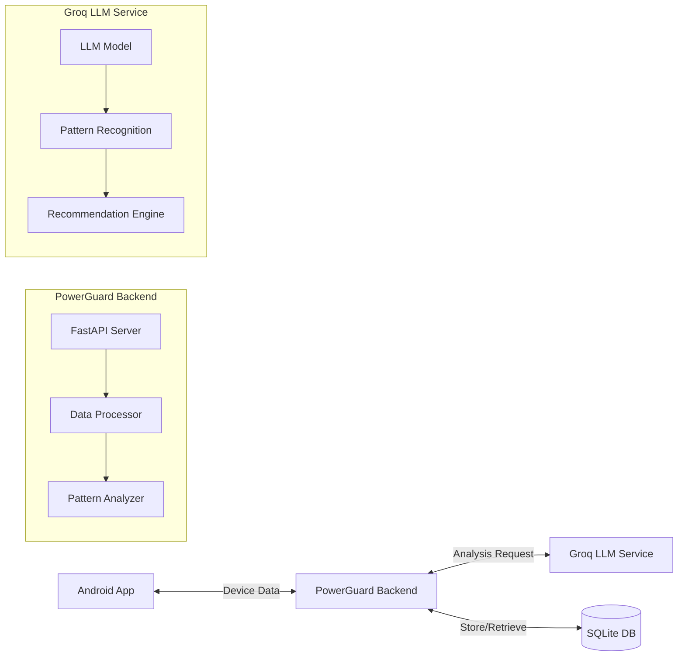
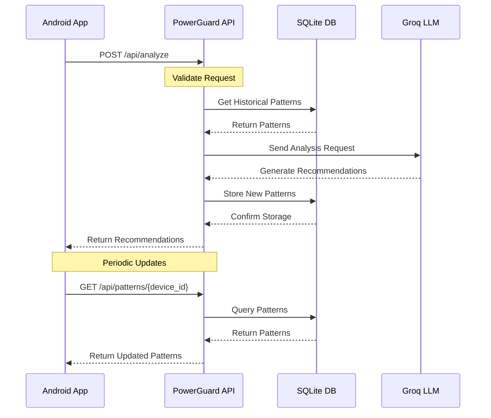

# PowerGuard AI Backend

A battery optimization service that uses AI to analyze device usage patterns and provide actionable recommendations for better battery life.

## Features

- Device usage analysis
- Battery optimization recommendations
- Usage pattern tracking
- Historical data analysis
- AI-powered insights
- Rate limiting and DDoS protection
- User-directed optimizations via prompts
- Hybrid rule-based and LLM prompt classification
- Smart context-aware prompt analysis with critical app protection
- Battery level based optimization strategy
- Time and data constraint-aware recommendations
- Information requests vs. optimization requests handling

## API Endpoints

- `POST /api/analyze` - Analyze device data and get optimization recommendations
- `GET /api/patterns/{device_id}` - Get usage patterns for a specific device
- `POST /api/reset-db` - Reset the database (use with caution)
- `GET /api/all-entries` - Get all database entries
- `GET /api/test/with-prompt/{prompt}` - Test endpoint that generates a sample response based on a prompt
- `GET /api/test/no-prompt` - Test endpoint that generates a sample response with default settings

## Rate Limits

To prevent abuse and ensure fair usage, the following rate limits are in place:

- Default endpoints: 100 requests per minute
- Analyze endpoint: 30 requests per minute
- Patterns endpoint: 60 requests per minute
- Reset DB endpoint: 5 requests per hour

When rate limits are exceeded, the API will return a 429 (Too Many Requests) status code.

## High-Level Design (HLD)

### System Architecture



### Components
1. **Client Application**
   - Android app collecting device data
   - Sends usage statistics to backend
   - Receives and displays recommendations

2. **Backend Service**
   - FastAPI-based REST API
   - SQLite database for data persistence
   - Integration with Groq LLM
   - Usage pattern analysis

3. **AI Service**
   - Groq LLM for intelligent analysis
   - Pattern recognition
   - Recommendation generation

### Data Flow



## Low-Level Design (LLD)

### Database Schema
```sql
CREATE TABLE usage_patterns (
    id INTEGER PRIMARY KEY,
    device_id TEXT NOT NULL,
    package_name TEXT NOT NULL,
    pattern TEXT NOT NULL,
    timestamp INTEGER NOT NULL,
    UNIQUE(device_id, package_name)
);
```

### API Models
1. **DeviceData**
   - App usage information
   - Battery statistics
   - Network usage data
   - Wake lock information
   - Optional prompt field for user-directed optimizations

2. **ActionResponse**
   - List of actionable recommendations
   - Summary of changes
   - Usage patterns
   - Timestamp
   - Battery, data, and performance scores
   - Estimated resource savings

### Key Components
1. **Data Collection**
   - App usage tracking
   - Battery monitoring
   - Network usage tracking
   - Wake lock detection

2. **Analysis Engine**
   - Pattern recognition
   - Historical data analysis
   - Recommendation generation
   - Prompt analysis and classification
   - User-directed optimization focus

3. **Storage Layer**
   - SQLite database
   - Pattern persistence
   - Historical data storage

## Setup and Installation

1. Clone the repository
2. Create a virtual environment:
   ```bash
   python -m venv venv
   source venv/bin/activate  # On Windows: venv\Scripts\activate
   ```
3. Install dependencies:
   ```bash
   pip install -r requirements.txt
   ```
4. Set up environment variables:
   ```
   GROQ_API_KEY=your_api_key_here
   ```
5. Run the application:
   ```bash
   python run.py
   ```

## API Documentation

Access the interactive API documentation at:
- Swagger UI: `/docs`
- ReDoc: `/redoc`

## Using Prompts for Directed Optimization

The PowerGuard system supports user-directed optimizations through the optional `prompt` field in the `/api/analyze` endpoint. This feature allows users to specify their optimization goals in natural language, and the system will adjust its analysis and recommendations accordingly.

### Prompt Types

#### Optimization Prompts

- **Battery Optimization**: "Optimize battery life", "Save power", "Extend battery"
- **Data Optimization**: "Reduce data usage", "Save network data", "Optimize internet usage"
- **Combined Optimization**: "Optimize both battery and data", "Save resources"
- **Specific Actions**: "Kill battery-draining apps", "Restrict background data"
- **Critical App Protection**: "Keep WhatsApp working", "I need maps and messages"
- **Time Constraints**: "Need battery to last 4 hours", "Make phone last until tonight"
- **Data Constraints**: "I only have 500MB left", "Save data, almost at my limit"

#### Information Prompts

- **Battery Usage Information**: "What apps are using the most battery?", "Show me battery-draining apps"
- **Data Usage Information**: "Which apps are using the most data?", "Top network consuming apps"
- **General Information**: "Show me my usage patterns", "What's consuming my resources?"

### How It Works

The system uses a multi-step analysis approach:

1. First, it determines if the prompt is an information request or an optimization request
2. For information requests, it generates insights without actionable recommendations
3. For optimization requests, it:
   - Identifies critical apps mentioned in the prompt (e.g., messaging, navigation)
   - Analyzes battery level to determine strategy aggressiveness
   - Considers time and data constraints mentioned in the prompt
   - Generates actionable recommendations that protect critical apps
   - Provides estimated resource savings based on the recommended actions

### Battery Level Based Strategies

The system adapts its strategy based on the current battery level:

- **Critical** (≤10%): Very aggressive optimization with maximum savings
- **Low** (≤30%): Aggressive optimization with significant savings
- **Moderate** (≤80%): Moderate optimization with balanced approach
- **High** (>80%): Minimal optimization focusing only on problematic apps

### Critical App Protection

When users mention specific app categories (e.g., "need maps and messages"), the system:

1. Identifies the critical apps in those categories
2. Ensures these apps remain in normal mode and are not restricted
3. Applies more aggressive optimizations to non-critical apps
4. Provides a balance between preserving functionality and maximizing resource savings

### Examples

```json
// Example 1: Battery optimization with low battery
{
  "deviceId": "example-device-001",
  "timestamp": 1686123456,
  "battery": { "level": 15 },
  "apps": [ ... ],
  "prompt": "Need to save battery"
}

// Example 2: Information request
{
  "deviceId": "example-device-001",
  "timestamp": 1686123456,
  "battery": { "level": 75 },
  "apps": [ ... ],
  "prompt": "What apps are using the most battery?"
}

// Example 3: Critical app protection with time constraint
{
  "deviceId": "example-device-001",
  "timestamp": 1686123456,
  "battery": { "level": 30 },
  "apps": [ ... ],
  "prompt": "I'm traveling for 3 hours and need maps and messaging"
}
```

### Testing Prompts

You can test how the system interprets different prompts using the test endpoints:

- `/api/test/with-prompt/{prompt}` - Test with a specific prompt
- `/api/test/no-prompt` - Test with default settings (optimize both battery and data)

## Development

- Python 3.9+
- FastAPI
- SQLAlchemy
- Groq LLM API
- SQLite

## License

MIT License 