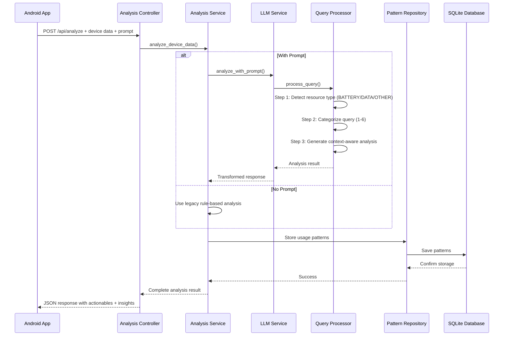

# PowerGuard AI Backend

<div align="center">
  
  
  
  
  
</div>

<p align="center">An AI-powered backend service that intelligently analyzes Android device usage patterns and provides contextual optimization recommendations through advanced natural language processing.</p>

<p align="center">
  <strong>📱 Android App Available:</strong> <a href="https://github.com/hiteshchopra11/PowerGuard">PowerGuard Android Client</a>
</p>

## 🏗️ Architecture

PowerGuard follows a **Service-Oriented Architecture** with clear separation of concerns:

```
┌─────────────────────────────────────────────────────────────────────┐
│                           SERVICE LAYERS                           │
├─────────────────────────────────────────────────────────────────────┤
│ Controllers (API Layer)     │ FastAPI Routers & HTTP Handling      │
│ Services (Business Logic)   │ Core Analysis & Optimization Logic   │
│ Repositories (Data Access)  │ Database Operations & Patterns       │
│ Schemas (API Contracts)    │ Pydantic Request/Response Models      │
│ Core (Infrastructure)      │ Database, Config, Exceptions         │
└─────────────────────────────────────────────────────────────────────┘
```

### Directory Structure
```
app/
├── controllers/            # API endpoints
│   ├── analysis.py        # /api/analyze endpoint
│   ├── patterns.py        # /api/patterns/* endpoints
│   └── health.py          # /api/reset-db endpoint
├── services/              # Business logic
│   ├── analysis_service.py    # Main orchestration service
│   ├── pattern_service.py     # Usage pattern management
│   ├── scoring_service.py     # Device scoring calculations
│   └── llm_service.py         # LLM integration service
├── repositories/          # Data access layer
│   └── usage_pattern_repository.py
├── schemas/               # Pydantic models
│   ├── device_data.py     # Request schemas
│   └── response.py        # Response schemas
├── core/                  # Infrastructure
│   ├── database.py        # Database configuration
│   ├── config.py          # Application settings
│   └── exceptions.py      # Custom exceptions
├── prompts/               # LLM prompt management
│   ├── query_processor.py # 3-step query analysis
│   └── system_prompts.py  # Prompt templates
├── config/                # App configuration
│   ├── app_categories.py  # Critical app definitions
│   └── strategy_config.py # Optimization strategies
├── utils/                 # Utility modules
│   ├── strategy_analyzer.py  # Strategy determination
│   ├── actionable_generator.py  # Action generation
│   └── insight_generator.py    # Insight generation
└── main.py               # FastAPI application setup
```

## 🧠 Advanced Query Processing System

PowerGuard implements a sophisticated **3-Step AI Query Processing System** via `app.prompts.query_processor:QueryProcessor`:

### Step 1: Resource Type Detection
Classifies user queries into resource categories:

```python
# Examples of resource type classification
"Save my battery" → BATTERY
"Reduce data usage" → DATA  
"Make phone faster" → OTHER
```

**Supported Resource Types:**
- **BATTERY**: Power consumption optimization
- **DATA**: Network usage optimization  
- **OTHER**: Performance, storage, general optimization

### Step 2: Query Categorization
Categorizes queries into 6 distinct types:

| Category | Intent | Example | Response Strategy |
|----------|--------|---------|------------------|
| **1. INFORMATION** | Data inquiry | "Which apps use most battery?" | **Insights only**, no actionables |
| **2. PREDICTIVE** | Future planning | "Will battery last 3 hours?" | **Yes/No answers** with explanations |
| **3. OPTIMIZATION** | Direct optimization | "Save my battery" | **Actionables + insights** |
| **4. MONITORING** | Alert setup | "Notify when battery < 20%" | **Configuration actions** |
| **5. PATTERN_ANALYSIS** | Usage insights | "Optimize based on my patterns" | **Historical analysis** |
| **6. INVALID** | Unrelated queries | "What's the weather?" | **Error guidance** |

### Step 3: Context-Aware Analysis
Generates responses using category-specific prompt templates with:

- **Device Context**: Battery level, memory, CPU, network status
- **App Analysis**: Usage patterns, consumption metrics
- **User Constraints**: Time limits, data limits, critical apps
- **Historical Patterns**: Past usage data for personalization

## 🎯 Intelligent Response Generation

### Actionable Types
PowerGuard generates specific device actions using these standardized types:

1. **SET_STANDBY_BUCKET** - App standby state management
   ```json
   {
     "type": "SET_STANDBY_BUCKET",
     "packageName": "com.facebook.katana",
     "newMode": "restricted", // active|working_set|frequent|rare|restricted
     "description": "Limit Facebook background activity"
   }
   ```

2. **RESTRICT_BACKGROUND_DATA** - Network access control
   ```json
   {
     "type": "RESTRICT_BACKGROUND_DATA", 
     "packageName": "com.instagram.android",
     "description": "Block Instagram background data usage"
   }
   ```

3. **KILL_APP** - Immediate app termination
   ```json
   {
     "type": "KILL_APP",
     "packageName": "com.spotify.music", 
     "description": "Force close Spotify to save battery"
   }
   ```

4. **MANAGE_WAKE_LOCKS** - Power management control
   ```json
   {
     "type": "MANAGE_WAKE_LOCKS",
     "packageName": "com.snapchat.android",
     "description": "Prevent Snapchat from keeping device awake"
   }
   ```

5. **THROTTLE_CPU_USAGE** - CPU frequency limitation
   ```json
   {
     "type": "THROTTLE_CPU_USAGE",
     "packageName": "com.rovio.angrybirds",
     "throttleLevel": "moderate",
     "description": "Reduce CPU usage for games"
   }
   ```

### Battery-Level Adaptive Strategy
PowerGuard adapts optimization aggressiveness based on current battery level (implemented in `app.utils.strategy_analyzer:determine_strategy`):

| Battery Level | Strategy | Actionable Intensity | Example Actions |
|--------------|----------|---------------------|----------------|
| **≤10% (Critical)** | Very Aggressive | Maximum restrictions | Kill non-critical apps, restrict background activity |
| **≤30% (Low)** | Aggressive | Strong limitations | Restrict background activity, reduce sync |
| **≤50% (Moderate)** | Balanced | Targeted optimization | Focus on problematic apps only |
| **>50% (High)** | Minimal | Light optimization | Target extreme consumers only |

### Critical App Protection
The system automatically protects essential apps during optimization (defined in `app.config.app_categories:APP_CATEGORIES`):

- **Messaging**: WhatsApp, Messenger, Viber
- **Navigation**: Google Maps, Waze, Mapbox  
- **Email**: Gmail, Outlook, Yahoo Mail
- **Social**: Facebook, Twitter, Instagram, Snapchat
- **Media**: Spotify, Netflix, YouTube, Pandora

## 🔄 Request/Response Flow



## 🛠️ Tech Stack

### Core Technologies
- **Python 3.12+** - Modern Python with type hints
- **FastAPI 0.115+** - High-performance async web framework
- **Pydantic** - Data validation and serialization
- **SQLAlchemy** - SQL toolkit and ORM
- **SQLite** - Embedded database for usage patterns

### AI/ML Stack
- **Groq API** - High-speed LLM inference (Llama-3.1-8b-instant)
- **Custom Prompt Engineering** - 6-category query classification system
- **JSON Mode** - Structured LLM responses for reliability

### Architecture & Patterns
- **Service-Oriented Architecture** - Clean separation of concerns
- **Repository Pattern** - Abstract data access layer
- **Dependency Injection** - FastAPI's built-in DI system
- **Custom Exception Handling** - Structured error management

### Development Tools
- **Uvicorn** - ASGI server for development
- **python-dotenv** - Environment variable management
- **Logging** - Structured application logging

## 🚀 API Endpoints

| Method | Endpoint | Description | Request Body |
|--------|----------|-------------|--------------|
| `POST` | `/api/analyze` | **Main Analysis** - Process device data with optional prompt | `DeviceData` schema |
| `GET` | `/api/patterns/{device_id}` | Get historical usage patterns | None |
| `GET` | `/api/all-entries` | Get all database entries | None |
| `POST` | `/api/reset-db` | ⚠️ Reset database | None |

### Request Schema Example
```json
{
  "deviceId": "unique-device-001",
  "timestamp": 1686123456.0,
  "prompt": "Save battery for 3 hours",
  "battery": {
    "level": 25.0,
    "temperature": 35.0,
    "isCharging": false,
    "chargingType": "none",
    "voltage": 3.8,
    "health": 95,
    "capacity": 4000.0,
    "currentNow": 500.0
  },
  "memory": {
    "totalRam": 8000000000.0,
    "availableRam": 4000000000.0,
    "lowMemory": false,
    "threshold": 1000000000.0
  },
  "cpu": {
    "usage": 45.0,
    "temperature": 45.0,
    "frequencies": [1800.0, 2400.0]
  },
  "network": {
    "type": "wifi",
    "strength": 85.0,
    "isRoaming": false,
    "dataUsage": {
      "foreground": 100.0,
      "background": 50.0,
      "rxBytes": 1000000.0,
      "txBytes": 500000.0
    },
    "activeConnectionInfo": "WiFi connected",
    "linkSpeed": 866.0,
    "cellularGeneration": "4G"
  },
  "apps": [
    {
      "packageName": "com.whatsapp",
      "processName": "com.whatsapp",
      "appName": "WhatsApp",
      "isSystemApp": false,
      "lastUsed": 1686123456.0,
      "foregroundTime": 3600.0,
      "backgroundTime": 1800.0,
      "batteryUsage": 15.0,
      "dataUsage": {
        "foreground": 10.0,
        "background": 5.0,
        "rxBytes": 100000.0,
        "txBytes": 50000.0
      },
      "memoryUsage": 128.0,
      "cpuUsage": 5.0,
      "notifications": 3,
      "crashes": 0,
      "versionName": "1.0.0",
      "versionCode": 1,
      "targetSdkVersion": 30,
      "installTime": 1686000000.0,
      "updatedTime": 1686100000.0,
      "alarmWakeups": 2,
      "currentPriority": "NORMAL",
      "bucket": "ACTIVE"
    }
  ],
  "deviceInfo": {
    "manufacturer": "Samsung",
    "model": "Galaxy S21",
    "osVersion": "13",
    "sdkVersion": 33,
    "screenOnTime": 18000
  },
  "settings": {
    "powerSaveMode": false,
    "dataSaver": false,
    "batteryOptimization": true,
    "adaptiveBattery": true,
    "autoSync": true
  }
}
```

### Response Schema Example
```json
{
  "id": "gen_1686123456",
  "success": true,
  "timestamp": 1686123456.789,
  "message": "Analysis completed successfully",
  "responseType": "optimization",
  "actionable": [
    {
      "id": "action_1686123456_0",
      "type": "SET_STANDBY_BUCKET",
      "description": "Limit Instagram background activity",
      "package_name": "com.instagram.android",
      "estimated_battery_savings": 15.0,
      "estimated_data_savings": 0.0,
      "severity": 2,
      "new_mode": "restricted",
      "enabled": true,
      "throttle_level": null,
      "reason": "High battery usage with moderate screen time",
      "parameters": {
        "packageName": "com.instagram.android",
        "newMode": "restricted"
      }
    }
  ],
  "insights": [
    {
      "type": "BATTERY",
      "title": "Instagram is consuming high battery",
      "description": "Instagram used 18.5% battery in the last 24 hours with moderate usage time.",
      "severity": "high"
    }
  ],
  "batteryScore": 75.0,
  "dataScore": 85.0, 
  "performanceScore": 80.0,
  "estimatedSavings": {
    "batteryMinutes": 120.0,
    "dataMB": 50.0
  }
}
```

## 📝 Prompt Examples

### Information Queries
```
"Which apps use the most battery?" → Insights only, no actionables
"Show me my data usage breakdown" → Data analysis without changes
"What's consuming my memory?" → Memory usage insights
```

### Optimization Requests
```
"Save my battery" → Battery-focused actionables + insights
"Reduce data usage" → Data-focused optimizations  
"Optimize everything" → Balanced battery + data optimization
"I need battery to last 4 hours" → Time-constrained optimization
```

### Critical App Protection
```
"Optimize battery but keep WhatsApp running" → Protect WhatsApp, optimize others
"I need maps and messaging for travel" → Protect navigation + messaging apps
"Don't touch my work apps" → Protect productivity apps during optimization
```

## 🛠️ Setup & Development

### Prerequisites
- Python 3.12+
- Groq API key ([Get one here](https://console.groq.com/))

### Quick Start
```bash
# Clone and setup
git clone <repository-url>
cd PowerGuardBackend
python -m venv venv
source venv/bin/activate  # Windows: venv\Scripts\activate

# Install dependencies  
pip install -r requirements.txt

# Configure environment
echo "GROQ_API_KEY=your_groq_api_key_here" > .env

# Start development server
python run.py
# Server runs at http://localhost:8000
```

### Testing
```bash
# Run comprehensive test suite
python run_all_tests.py

# Test specific scenarios
python automated_test.py

# Database tools
python inspect_db.py
python reset_db.py  # ⚠️ Destructive
```

## 📄 License

MIT License

---

<div align="center">
  <strong>PowerGuard AI Backend</strong><br>
  Production-ready Android optimization powered by advanced AI
</div>