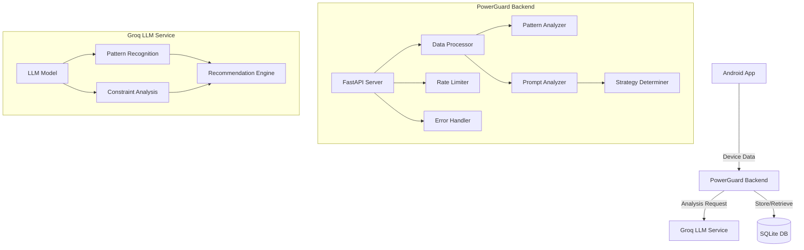
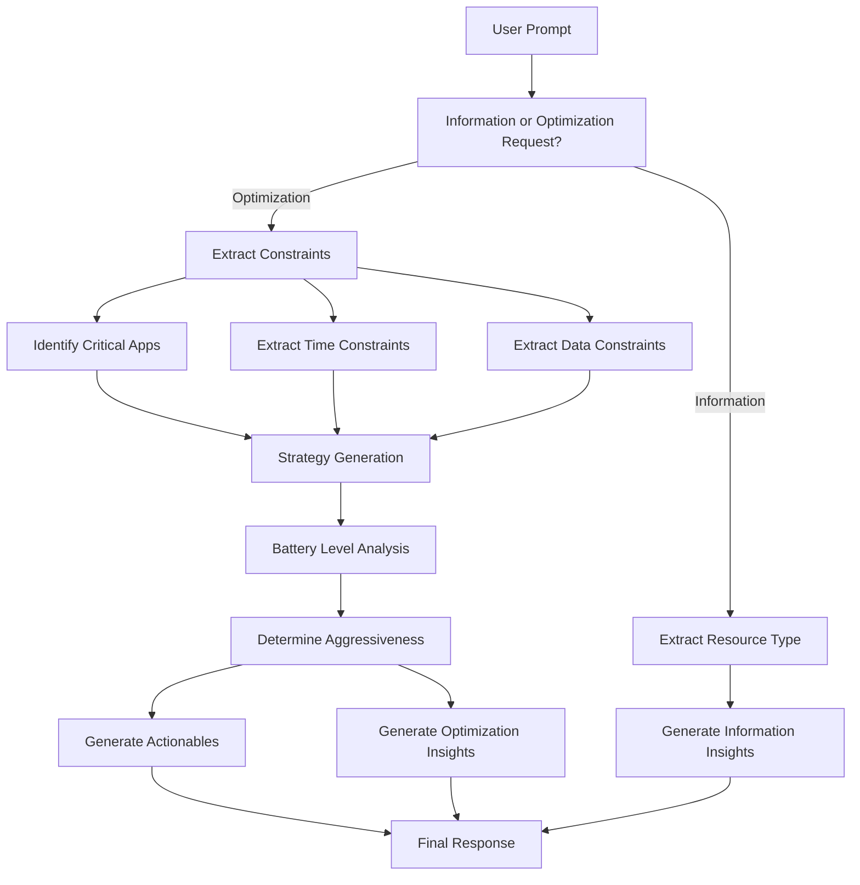
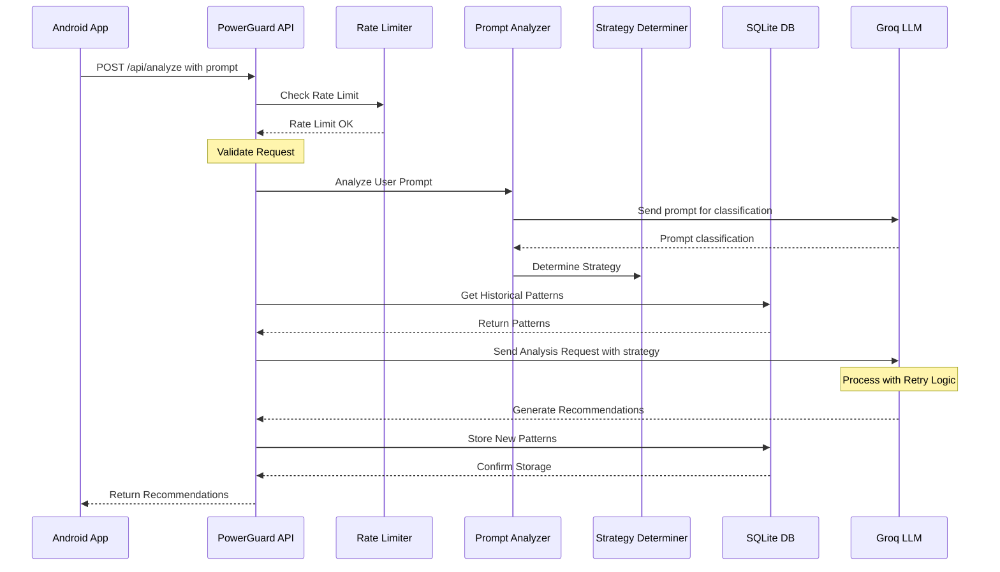

# PowerGuard AI Backend

<div align="center">
  
  
  
  
</div>

<p align="center">A battery and data optimization service that uses AI to analyze device usage patterns and provide actionable recommendations for better battery life and data usage.</p>

<div align="center">
  
</div>

## ✨ Features

- 🔋 Device usage analysis
- 📊 Battery optimization recommendations
- 📱 Usage pattern tracking
- 🧠 Historical data analysis
- 🤖 AI-powered insights
- 💡 User-directed optimizations via prompts
- 🔄 Hybrid rule-based and LLM prompt classification
- 🧩 Smart context-aware prompt analysis with critical app protection
- 🎯 Battery level based optimization strategy
- ⏱️ Time and data constraint-aware recommendations
- 💬 Information requests vs. optimization requests handling

## 🚀 API Endpoints

- `POST /api/analyze` - Analyze device data and get optimization recommendations
- `GET /api/patterns/{device_id}` - Get usage patterns for a specific device
- `POST /api/reset-db` - Reset the database (use with caution)
- `GET /api/all-entries` - Get all database entries
- `GET /api/test/with-prompt/{prompt}` - Test endpoint that generates a sample response based on a prompt
- `GET /api/test/no-prompt` - Test endpoint that generates a sample response with default settings

## 🏗️ System Architecture



## 📊 Smart Prompt Analysis Flow



## 🔄 Data Flow



## 🧩 Components

1. **Client Application**
   - Android app collecting device data
   - Sends usage statistics to backend
   - Receives and displays recommendations

2. **Backend Service**
   - FastAPI-based REST API
   - SQLite database for data persistence
   - Integration with Groq LLM
   - Usage pattern analysis

3. **AI Service**
   - Groq LLM for intelligent analysis
   - Pattern recognition
   - Recommendation generation

## 🔋 Battery Level Based Strategies

PowerGuard adapts its optimization strategy based on current battery level:

| Battery Level | Strategy | Approach | Example Actions |
|--------------|----------|----------|----------------|
| ≤10% (Critical) | Very Aggressive | Maximum restrictions on non-critical apps, significant UI optimizations | Kill background processes, force dark mode, limit sync, restrict GPS |
| ≤30% (Low) | Aggressive | Strong restrictions on background activity, moderate UI optimizations | Restrict background refresh, moderate sync intervals, reduce location precision |
| ≤50% (Moderate) | Balanced | Balanced approach focusing on problematic apps | Optimize problematic apps, normal sync intervals, standard UI settings |
| >50% (High) | Minimal | Light optimizations only for the most resource-intensive apps | Target only extremely high battery consumers, normal operation for most apps |

## 🗣️ Using Prompts for Directed Optimization

The PowerGuard system supports user-directed optimizations through the optional `prompt` field in the `/api/analyze` endpoint. This feature allows users to specify their optimization goals in natural language, and the system will adjust its analysis and recommendations accordingly.

### Prompt Types and Examples

#### Information Requests

| Request Type | Example Prompts | System Response |
|--------------|----------------|-----------------|
| Battery Usage Information | "What apps are using the most battery?" | Returns insights about battery-consuming apps without actionable recommendations |
| Data Usage Information | "Which apps are using the most data?" | Returns insights about data-consuming apps without actionable recommendations |
| General Information | "Show me my usage patterns" | Returns general usage insights without specific actionable recommendations |

#### Optimization Requests

| Request Type | Example Prompts | System Response |
|--------------|----------------|-----------------|
| Battery Optimization | "Optimize battery life", "Save power", "Make battery last longer" | Generates battery-focused optimization actions |
| Data Optimization | "Reduce data usage", "Save network data", "Optimize internet usage" | Generates data-focused optimization actions |
| Combined Optimization | "Optimize both battery and data", "Save resources", "Make phone more efficient" | Balanced optimization for both battery and data |
| Specific Actions | "Kill battery-draining apps", "Restrict background data", "Turn off unnecessary services" | Generates very specific actions matching the request |
| Critical App Protection | "Keep WhatsApp working", "I need maps and messages", "Don't touch my email app" | Protects specified apps while optimizing others |
| Time Constraints | "Need battery to last 4 hours", "Make phone last until tonight", "Save battery until I get home" | Adjusts strategy aggressiveness based on time requirement |
| Data Constraints | "I only have 500MB left", "Save data, almost at my limit", "Strict data saving mode" | Focuses heavily on data optimization |
| Complex Constraints | "I'm traveling for 3 hours and need maps and messaging but save battery" | Comprehensive strategy balancing all constraints |

### Critical App Categories

PowerGuard recognizes these critical app categories that are often protected during optimization:

1. **Messaging Apps**: WhatsApp, Messenger, Telegram, Signal, WeChat
2. **Navigation Apps**: Google Maps, Waze, Apple Maps, Mapbox, HERE Maps
3. **Email Apps**: Gmail, Outlook, ProtonMail, Apple Mail
4. **Work/Productivity**: Slack, Teams, Zoom, Office apps, Google Workspace
5. **Health & Safety**: Health monitoring, Emergency services, Safety alerts

## 📝 Sample API Responses

### Example 1: Battery Optimization

**Request:**
```json
{
  "deviceId": "example-device-001",
  "timestamp": 1686123456,
  "battery": { "level": 15 },
  "apps": [
    {"packageName": "com.whatsapp", "batteryUsage": 5.2, "dataUsage": 20.1, "foregroundTime": 10},
    {"packageName": "com.instagram", "batteryUsage": 15.4, "dataUsage": 45.3, "foregroundTime": 25},
    {"packageName": "com.facebook.katana", "batteryUsage": 12.1, "dataUsage": 30.2, "foregroundTime": 15}
  ],
  "prompt": "Save my battery"
}
```

**Response:**
```json
{
  "id": "resp-12345",
  "success": true,
  "timestamp": 1686123458,
  "message": "Battery optimization strategy applied",
  "actionable": [
    {
      "id": "act-001",
      "type": "app_restriction",
      "packageName": "com.facebook.katana",
      "description": "Restrict Facebook background activity",
      "reason": "High battery consumption (12.1%) with moderate usage time",
      "newMode": "restricted",
      "parameters": {"backgroundRestriction": true}
    },
    {
      "id": "act-002",
      "type": "app_restriction",
      "packageName": "com.instagram",
      "description": "Limit Instagram refresh rate",
      "reason": "Highest battery consumption (15.4%)",
      "newMode": "optimized",
      "parameters": {"backgroundRefresh": "reduced"}
    },
    {
      "id": "act-003",
      "type": "system_setting",
      "description": "Reduce screen brightness by 15%",
      "reason": "Low battery level (15%) requires aggressive power saving",
      "newMode": "power_saving",
      "parameters": {"brightnessReduction": 15}
    }
  ],
  "insights": [
    {
      "type": "battery_usage",
      "title": "Instagram is your top battery consumer",
      "description": "Instagram is using 15.4% of your battery. The recommended restrictions should save approximately 7-9% battery usage.",
      "severity": "high"
    },
    {
      "type": "strategy_info",
      "title": "Aggressive battery saving strategy applied",
      "description": "Your battery level is low (15%), so we've applied aggressive optimizations to extend battery life.",
      "severity": "info"
    }
  ],
  "batteryScore": 35,
  "dataScore": 72,
  "performanceScore": 65,
  "estimatedSavings": {
    "batteryMinutes": 45,
    "dataMB": 15
  }
}
```

### Example 2: Information Request

**Request:**
```json
{
  "deviceId": "example-device-001",
  "timestamp": 1686123456,
  "battery": { "level": 75 },
  "apps": [
    {"packageName": "com.whatsapp", "batteryUsage": 5.2, "dataUsage": 20.1, "foregroundTime": 10},
    {"packageName": "com.instagram", "batteryUsage": 15.4, "dataUsage": 45.3, "foregroundTime": 25},
    {"packageName": "com.facebook.katana", "batteryUsage": 12.1, "dataUsage": 30.2, "foregroundTime": 15}
  ],
  "prompt": "What apps are using the most battery?"
}
```

**Response:**
```json
{
  "id": "resp-12346",
  "success": true,
  "timestamp": 1686123460,
  "message": "Battery usage information provided",
  "actionable": [],
  "insights": [
    {
      "type": "battery_usage",
      "title": "Instagram is your top battery consumer",
      "description": "Instagram is using 15.4% of your battery over the last 24 hours.",
      "severity": "high"
    },
    {
      "type": "battery_usage",
      "title": "Facebook is your second highest battery consumer",
      "description": "Facebook is using 12.1% of your battery over the last 24 hours.",
      "severity": "medium"
    },
    {
      "type": "battery_usage",
      "title": "WhatsApp has moderate battery usage",
      "description": "WhatsApp is using 5.2% of your battery over the last 24 hours.",
      "severity": "low"
    },
    {
      "type": "information_only",
      "title": "Battery Information Request",
      "description": "This is an information-only response with no optimization actions.",
      "severity": "info"
    }
  ],
  "batteryScore": 68,
  "dataScore": 72,
  "performanceScore": 75,
  "estimatedSavings": {
    "batteryMinutes": 0,
    "dataMB": 0
  }
}
```

### Example 3: Critical App Protection

**Request:**
```json
{
  "deviceId": "example-device-001",
  "timestamp": 1686123456,
  "battery": { "level": 25 },
  "apps": [
    {"packageName": "com.whatsapp", "batteryUsage": 5.2, "dataUsage": 20.1, "foregroundTime": 10},
    {"packageName": "com.google.android.apps.maps", "batteryUsage": 18.5, "dataUsage": 35.7, "foregroundTime": 30},
    {"packageName": "com.instagram", "batteryUsage": 15.4, "dataUsage": 45.3, "foregroundTime": 25},
    {"packageName": "com.facebook.katana", "batteryUsage": 12.1, "dataUsage": 30.2, "foregroundTime": 15}
  ],
  "prompt": "I'm traveling for 3 hours and need maps and messaging"
}
```

**Response:**
```json
{
  "id": "resp-12347",
  "success": true,
  "timestamp": 1686123462,
  "message": "Optimization with critical app protection applied",
  "actionable": [
    {
      "id": "act-001",
      "type": "app_protection",
      "packageName": "com.google.android.apps.maps",
      "description": "Google Maps protected for navigation",
      "reason": "You mentioned needing maps for traveling",
      "newMode": "normal",
      "parameters": {"protectionLevel": "full"}
    },
    {
      "id": "act-002",
      "type": "app_protection",
      "packageName": "com.whatsapp",
      "description": "WhatsApp protected for messaging",
      "reason": "You mentioned needing messaging",
      "newMode": "normal",
      "parameters": {"protectionLevel": "full"}
    },
    {
      "id": "act-003",
      "type": "app_restriction",
      "packageName": "com.instagram",
      "description": "Restrict Instagram completely",
      "reason": "High battery and data usage with non-critical functionality",
      "newMode": "restricted",
      "parameters": {"backgroundRestriction": true, "dataRestriction": true}
    },
    {
      "id": "act-004",
      "type": "app_restriction",
      "packageName": "com.facebook.katana",
      "description": "Restrict Facebook completely",
      "reason": "High battery and data usage with non-critical functionality",
      "newMode": "restricted",
      "parameters": {"backgroundRestriction": true, "dataRestriction": true}
    },
    {
      "id": "act-005",
      "type": "system_setting",
      "description": "Enable battery saver mode",
      "reason": "Low battery level (25%) with 3-hour time constraint",
      "newMode": "power_saving",
      "parameters": {"batterySaverEnabled": true}
    }
  ],
  "insights": [
    {
      "type": "constraint_analysis",
      "title": "Critical apps protected for 3-hour journey",
      "description": "Google Maps and WhatsApp have been protected to ensure they function normally during your 3-hour travel period.",
      "severity": "info"
    },
    {
      "type": "battery_usage",
      "title": "Google Maps is your top battery consumer",
      "description": "Maps uses significant battery (18.5%). Keep your phone charged while navigating if possible.",
      "severity": "high"
    },
    {
      "type": "strategy_info",
      "title": "Aggressive optimization applied to non-critical apps",
      "description": "Non-essential apps like Instagram and Facebook have been restricted to maximize battery life for your 3-hour journey.",
      "severity": "info"
    }
  ],
  "batteryScore": 28,
  "dataScore": 35,
  "performanceScore": 55,
  "estimatedSavings": {
    "batteryMinutes": 95,
    "dataMB": 65
  }
}
```

### Example 4: Data Constraint

**Request:**
```json
{
  "deviceId": "example-device-001",
  "timestamp": 1686123456,
  "battery": { "level": 65 },
  "apps": [
    {"packageName": "com.whatsapp", "batteryUsage": 5.2, "dataUsage": 20.1, "foregroundTime": 10},
    {"packageName": "com.youtube", "batteryUsage": 22.5, "dataUsage": 350.7, "foregroundTime": 45},
    {"packageName": "com.spotify.music", "batteryUsage": 8.4, "dataUsage": 120.3, "foregroundTime": 35}
  ],
  "prompt": "I only have 500MB data left this month"
}
```

**Response:**
```json
{
  "id": "resp-12348",
  "success": true,
  "timestamp": 1686123464,
  "message": "Data conservation strategy applied",
  "actionable": [
    {
      "id": "act-001",
      "type": "app_restriction",
      "packageName": "com.youtube",
      "description": "Restrict YouTube to Wi-Fi only",
      "reason": "Extremely high data usage (350.7MB)",
      "newMode": "data_restricted",
      "parameters": {"dataRestriction": "wifi_only"}
    },
    {
      "id": "act-002",
      "type": "app_restriction",
      "packageName": "com.spotify.music",
      "description": "Set Spotify to data saving mode",
      "reason": "High data usage (120.3MB)",
      "newMode": "data_saving",
      "parameters": {"dataRestriction": "savings_mode"}
    },
    {
      "id": "act-003",
      "type": "system_setting",
      "description": "Enable Data Saver system-wide",
      "reason": "Limited data remaining (500MB constraint)",
      "newMode": "data_saving",
      "parameters": {"dataSaverEnabled": true}
    }
  ],
  "insights": [
    {
      "type": "data_usage",
      "title": "YouTube is your top data consumer",
      "description": "YouTube has used 350.7MB of data. Restricting it to Wi-Fi could save you approximately 300-350MB per month.",
      "severity": "critical"
    },
    {
      "type": "data_usage",
      "title": "Spotify is your second highest data consumer",
      "description": "Spotify has used 120.3MB of data. Using data saving mode or downloading playlists on Wi-Fi could save 100-120MB per month.",
      "severity": "high"
    },
    {
      "type": "constraint_analysis",
      "title": "Data conservation plan for 500MB limit",
      "description": "The recommended actions should help you stay within your 500MB remaining data limit for the month.",
      "severity": "info"
    }
  ],
  "batteryScore": 68,
  "dataScore": 25,
  "performanceScore": 78,
  "estimatedSavings": {
    "batteryMinutes": 15,
    "dataMB": 420
  }
}
```

## 🛠️ Setup and Installation

1. Clone the repository
2. Create a virtual environment:
   ```bash
   python -m venv venv
   source venv/bin/activate  # On Windows: venv\Scripts\activate
   ```
3. Install dependencies:
   ```bash
   pip install -r requirements.txt
   ```
4. Set up environment variables:
   ```
   GROQ_API_KEY=your_api_key_here
   ```
5. Run the application:
   ```bash
   python run.py
   ```

## 🧪 Testing the Application

PowerGuard includes several test scripts to verify its functionality:

1. **Run All Tests**:
   ```bash
   python run_all_tests.py
   ```

2. **Test Specific Prompts**:
   ```bash
   python test_case_runner.py --prompt "Save my battery"
   ```

3. **Test with Automated Scenarios**:
   ```bash
   python automated_test.py
   ```

4. **Benchmark Performance**:
   ```bash
   python benchmark.py --prompt battery --requests 20
   ```

For more details on testing options, see the [TESTING.md](TESTING.md) documentation.

## 📚 API Documentation

Access the interactive API documentation at:
- Swagger UI: `/docs`
- ReDoc: `/redoc`

## 📄 License

MIT License 